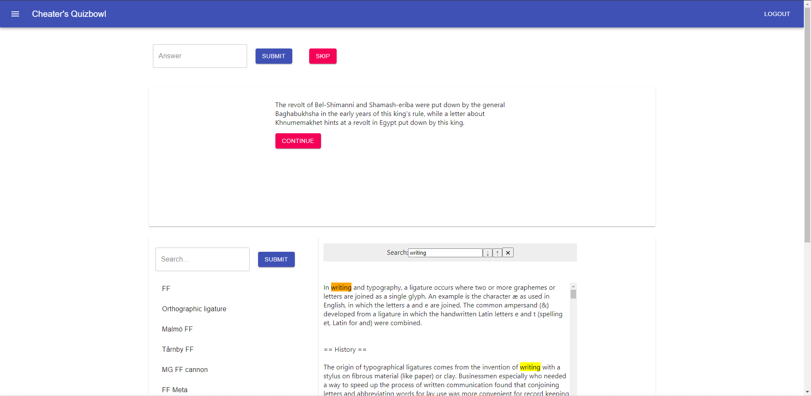

# cheaters_quizbowl
 An interface for playing "cheater's bowl", AKA quizbowl with a search engine. Purpose is to collect data on question answering strategies. Part of research for the [Pinafore group](https://github.com/Pinafore) at UMD.
 
 Frontend is written in React, backend is written in Python (FastAPI).

## Features

- Question reading
- Question answering
- Search and view external documents (Wikipedia)
- View sections and subsections
- Keyword search (Ctrl-F)

## Setup

Install dependencies:  
`poetry install`  
In `app`: `yarn install`

Download the QANTA dataset (sqlite database, e.g. `qanta.2018.04.18.sqlite3`) from https://github.com/Pinafore/qb, move it to `backend/data`  
Enter poetry environment: `poetry shell`  
Run script to create tables: `python -m backend.create_tables`  
Run app: `. ./run_app.sh`  
Access app at http://localhost:3000/  

### What run_app does
Run backend:  
`uvicorn backend.server:app`

Run frontend:  
`yarn start`

Run reverse proxy (enables frontend and backend to communicate):  
`caddy run`

## Architecture

### Backend

`server.py` - main server

### Frontend
- App
    - Login
    - Dashboard_preloaded: the UI container
        - Navbar
        - AnswerForm
        - QuestionDisplayUntimed: displays the question
        - Searcher: search articles
            - KeywordSearch: search by keyword
