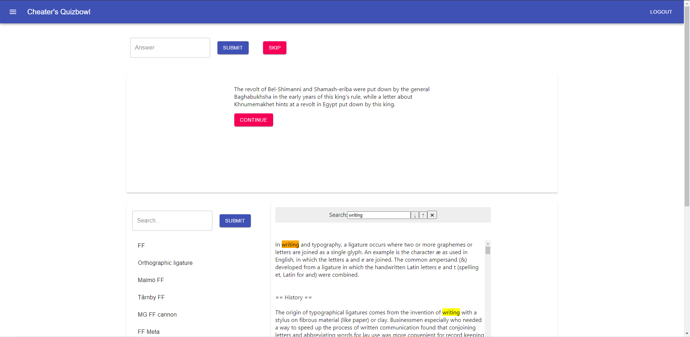

# cheaters_quizbowl
 An interface for playing "cheater's bowl", AKA quizbowl with a search engine. Purpose is to collect data on question answering strategies. Part of research for the [Pinafore group](https://github.com/Pinafore) at UMD.
 
 Frontend is written in React, backend is written in Python (FastAPI).

## Features

- Question reading
- Question answering
- Search and view external documents (Wikipedia)
- Keyword search (Ctrl-F)

## Setup

Install dependencies:  
backend: `poetry install`  
app: `yarn i`

Download the QANTA dataset (sqlite database) from https://github.com/Pinafore/qb, move it to `backend/data`  
Add tables (todo)

Run backend:  
`uvicorn backend.web:app`

Run frontend:  
`yarn start`

Run reverse proxy (enables frontend and backend to communicate):  
`caddy run`
